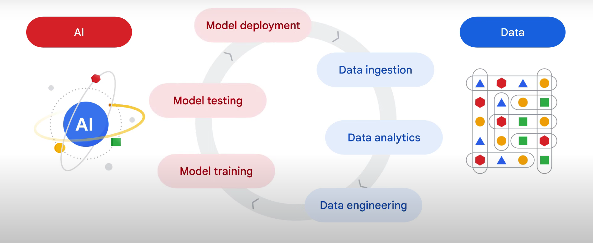

### Agenda 
    **Understand the usecase of AI.**  
        Why AI?
        How AI helps you innovate business processes and improve business efficiency.

    **Understand Google Cloud services for AI Devlopment**
        Why Google and how to start an AI project on Google Cloud?
        AI/ML framework and helps you navigate through the whole course.
    
    **Google Cloud's infrastructure**
        Google Cloud's infrastructure, focusing on compute and storage.
     
    **Data and AI Products**
        Examine the products that support your journey from data to AI on Google Cloud.

    **ML Model Categories**
        ML model categories, which provides context to understand ML model building.
    
    **BigQuery ML**
        Explore BigQuery, and specifically BigQuery ML, and walk through the steps to build an ML model with SQL commands.

    **Hands ON**    
        Hands-on lab to build your first ML model on Google Cloud with BigQuery ML.

### Why AI ?
    Let's explore an example to understand how AI can enhance business efficiency and transform operations.
    
    Coffee on Wheels, an international company that sells coffee on trucks in cities like London, New York, San Francisco, and Tokyo, provides a compelling case study.

    Coffee on Wheels is facing three main challenges: 
    >> Location selection route optimization Predicting popular locations for truck placement, and optimizing routes based on weather and traffic conditions.
    >> Sales forecast and real-time monitoring Forecasting sales and monitoring performance in real-time.
    >> Marketing campaign automation Automating marketing campaigns to increase efficiency and effectiveness.

    Inputs
        This involves incorporating various forms of data, such as 
        Text (customer reviews, weather and event data), 
        Images (coffee and dessert pictures), and
        Videos (real-time street view).
        Apps/ERP
    
    Prediction and generation 
        This is powered by data analytics like 
        Customer segment analysis, 
        Predictive AI like sales forecasting, and 
        Generative AI like marketing campaign automation.

    Visual output 
        The insights and reports are then presented visually, 
        Empowering businesses to make real-time data-driven decisions, and 
        Optimize their operations.

    Google products that collaborate to make this application possible
        Gemini multimodal enables data acquisition [Input]
        BigQuery provides data analytics, [Prediction and generation]
        Vertex AI handles ML development,[Prediction and generation]
        Looker and Google APIs contribute to data visualization and app creation.[Visual output]
        
### Data Beans Architecture

    

    This application's development encompasses the entire data to AI lifecycle.
    It includes data ingestion, data analytics, data engineering, model training, testing, and deployment.
    These processes are supported by Google's unified development platforms.
    Google's AI development platform enables the utilization of various types of AI, including predictive AI for
    tasks like sales forecasting, generative AI for tasks like automating marketing campaigns, and hybrid approaches that combine both.

### Conclusion
    By leveraging the application, Coffee on Wheels gained the following benefits: 
        Streamlined business processes in key areas such as marketing, digital commerce, and back-office operations.
        Modernized customer service through features such as automated comment replies and actionable consumer insights and predictions.
        Enhanced employee productivity through the utilization of GenAI for code assistance and marketing content generation.
    
